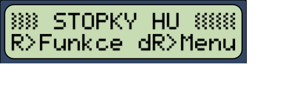

Testovací repozitář pro každého, kdo chce pomoct s vývojem.

Tato verze je dostatečně otestovaná na v4.1 i v5.0 a lze používat v závodech.

Co se změnilo je uvedeno v souboru [CHANGELOG.md](./CHANGELOG.md).

Firmware ke stažení je ve složce [rms03/build/fw/](./rms03/build/fw/).

Který soubor stáhnout je popsáno níže v textu. (Vpravo od README je ikona pro obsah tohoto dokumentu.)

Ujistěte se, že máte zálohu firmware, který můžete v případě potřeby nahrát zpět.

-----

# RMS 0.3

**Modulární** firmware (nejen) pro Stopky v4.1 a v5.0 a externí sériové displeje od Sakul.cz
- rychlé a **přesné** měření
- ovládání zařízení **tlačítky**
- rozlišení časů na vstupech **4 µs**
- **záznam závodu** do terminálu, vč. vyhodnocení závodu
- **hodiny** s RTC nebo interní/softwarové
- ovládání displejů z ohledem na **diváky**
- **libovolná** konfigurace externích displejů

Otestováno natolik, že je vhodné pro závody.

Tato verze obsahuje:
- [Stopky HU](#modul-stopky-hu)
- [Stopky S-S](#modul-stopky-s-s)
- [Stopky S-LP](#modul-stopky-s-lp)
- [Hodiny](#modul-hodiny)
- [Nastavení](#modul-nastavení)
- [Demo](#modul-demo)

RMS není určeno pro jednu konkrétní verzi stopek, ale slouží jako univerzální **jádro** a **framework**.

*"Potřebujete obsloužit 24h závod s konfigurací externích displejů s 10 a 5 znaky, kdy na jednom budou stopky HH:MM:SS.ss a na druhém hodiny HH:MM? S RMS takový modul lze udělat a otestovat za dvě tři hodiny."*

-----

## Ovládání

Pro efektivní ovládání zařízení je dobré vědět, co je a co není **modul.**

### Modul obecně

Modul určuje **logiku** ovládání, reaguje na události a určuje, co bude kdy na kterém displeji.

Modul **neobsluhuje** hardware. (O vstupy, časy událostí, fyzický přenos do displejů, evidenci logu, výpočty časů apod. se stará tzv. **jádro,** ve kterém modul "žije.")

Moduly lze **přepínat** a Stopky mají tolik funkcí, kolik modulů je v programu. Modulů může být tolik, kolik se vejde do paměti - dva u Stopek v4.1, velmi hodně u Stopek v5.0 (nebo u Arduino ATmega2560).

Jinými slovy:
- vždy je **aktivní právě jeden** modul
- pro spuštěný modul ostatní moduly "neexistují"
- není možné, aby jiný modul dělal něco na pozadí
- chyba v modulu **neovlivní** ostatní moduly
- modul neřeší např. čas sepnutí kontaktu, ten dostává od jádra

### Modul je FSM

Každý modul je stavový automat ([FSM](https://en.wikipedia.org/wiki/Finite-state_machine)), který podle svého aktuálního **stavu** vykonává právě jednu věc.

Modul **reaguje** na události a **přechází** ze stavu do stavu. (Čímž se - mimojiné - významně snižuje chybovost a zrychluje tvorba nového modulu.)

Správně vytvořený modul má rychlost provádění programu **40-70 tisíc** opakování za vteřinu podle toho, kolik má aktuálně práce. Jinými slovy **reakční doba** na události či **přechod mezi stavy** je typicky kolem 15-25 µs.

FSM modulu "HU" (Hasičský útok s odpočtem času) vypadá takto:

-----

## Ovládání obecně

Zatím existující moduly mají stejnou logiku ovládání: tlačítko Reset (`R`) stále dokola přepíná stavy, které modul má. Některé moduly mají pouze jeden stav a proto krátký stisk `R` nic nedělá. 

K orientaci, kde se modul (uživatel) nachází slouží výhradně LCD displej. Na LCD displeji 20x4 je nápověda prakticky vždy, na 16x2 jen když je místo.

### Výběr (přepnutí) modulu

Přepnout modul nejde vždy - modul musí být ve stavu, který přepnutí umožňuje. Typicky ve výchozím stavu "nic nedělání" (na LCD nahoře znárorněno silným pruhem).

Tedy: silný pruh nahoře -> modul jde přepnout.

Při delším stisku `R` se po chvíli objeví **Menu**, `R` je nutné držet stisknuté. Nazvěme to "Dlouhý Reset". Potom `L` a `P` vybírá možnost, `S` mění zobrazenou nabídku.

Menu "Dlouhý Reset" má tři nabídky.

**Přepnutí modulu** - `L` `P` vybírá modul, uvolněním `R` se přepne.

**Zobrazování časů pulzů** - `L` `P` mění zapnuto/vypnuto, uvolněním `R` se vrátí do modulu.

**Uložit nastavení** - `L` uloží nastavení systému, `P` uloží nastavení modulu.

*Nastavení systému:* uloží aktuálně spuštěný modul jako výchozí po restartu + nastavení zobrazování pulzů.

*Nastavení modulu:* uloží parametry aktuálního modulu, pokud to spuštěný modul podporuje.

Poznámka: R+ v terminálu označuje právě takový stisk `R`, kdy jádro kontroluje dlouhý stisk a případně zobrazí menu. Je-li aktivní toto menu, není aktivní modul.

### Stav modulu graficky

**Silný čerchovaný pruh** v prvním řádku displeje - viz predchozí bod.

**Slabý čerchovaný pruh** - modul je ve stavu, kdy čeká "na práci."

**Slabý černý pruh** - modul "pracuje."

## Ovládání/funkce jednotlivých modulů

### Modul "Stopky HU"

*"Stopky pro hasičský útok (závod ve dvou drahách) s odpočtem času na přípravu družstva"*

`R` přepíná stavy **Výchozí** | **Odpočet** | **Závod**

**Výchozí**
- vymaže dispeje (pouze při spuštění modulu) (při potřebě vymazat displeje podrž `R` a spusť modul znovu)

**Odpočet**
- nastaví na displeje délku odpočtu
- `L` a `P` mění dobu odpočtu
- `S` spustí odpočet, `R` běžící odpočet přeruší
- po skončení/přerušení běžícího odpočtu přejde do stavu **Závod**

**Závod**
- kontroluje stavy koncových spínačů
  - pokud je některý spínač sepnutý, modul přechází do stavu **Chyba** a na displeji svítí "-E-"
  - jakmile chyba skončí, vrací se zpět do stavu **Závod**
- `S` odstartuje závod

**Běžící závod**
- `M` zaznamená mezičas (jen v5.0)
- `L` a `P` ukončuje měření v dráze
- jakmile je Levá i Pravá v cíli, přechází do stavu **Měření ukončeno** a tiskne log
- `R` zruší měření a přechází do stavu **Měření ukončeno**

Nejlépe je ale vždy vidět funkčnost modulu na jeho [FSM](./doc/fsm-hu.png)

Poznámka:
- čas odpočtu a nuly se na displeje posílají se zpožděním 2,5 vteřiny proto, aby displeje neblikaly při výběru stavu. (Čas lze změnit v Nastavení.)
- při volbě "Uložit nastavení modulu" z menu "Dlouhý Reset" se nastavený čas odpočtu uloží jako výchozí

### Modul "Stopky S-S"

*"Stopky pro závod v jedné dráze, se startem i ukončením `S` (proto S-S)"*

I když má modul pouze jeden stav pro stopky, `R` střídá stavy **Výchozí** a **Stopky**. To proto, aby šlo na displejích mít nuly (závod připraven), cílové časy nebo cedule vymazat a mít je prázdné. Ovládání je analogické s "HU".

Modul nekontroluje chyby na koncových spínačích.

### Modul "Stopky S-LP"

*"Stopky pro závod v jedné dráze, se startem `S` a ukončením `L` nebo `P` (proto S-LP)"*

Ovládání je analogické s výše uvedenými moduly.

Modul nekontroluje chyby na koncových spínačích.

### Modul "Hodiny"

*"Zobrazení aktuálního času na displejích pro chvíle, kdy je zrovna pauza"*

Po aktivaci modulu zobrazí čas na prvním displeji (levá dráha), na LCD i na interním.

Firmware pro RTC hodiny nemá žádný další stav a datum/čas se nastavuje v modulu Nastavení.

Ve firmware s interními hodinami přepíná `R` mezi zobrazováním a nastavením hodin. Pokud hodiny nejsou nastavené a aktivované, čas se nezobrazuje.

Poznámky:
- aktuální datum a čas se do logu tiskne:
  - s RTC vždy
  - jen pokud jsou interní hodiny aktivní
- pokud modul Hodiny instalovaný není, log neobsahuje datum a čas
- (jen interní hodiny) při volbě "Uložit nastavení modulu" z menu "Dlouhý Reset" se uloží jen datum, ne čas

### Modul "Nastavení"

Slouží k úpravám nastavení systému a modulů. Pro ovládání (komunikaci s modulem) je potřeba sériový terminál se vstupní řádkou.

#### Příkazy

##### help

Vypíše seznam příkazů, které konkrétní firmare podporuje.

##### info

Vypíše informace o hardware a firmware.
Při hlášení chyb vždy prosím přiložte tyto informace.

##### rtc

Zadáním `rtc YYYY-MM-DD HH:MM:SS` se nastaví zadaný datum a čas do RTC.
(Ve verzi s interními hodinami není.)

##### list, set, del

Každý modul má svůj "identifikátor" (číslo 1-127) a může si ukládat svá nastavení a konfigurace do EEPROM paměti. (Identifikátor "0" využívá jádro/systém.)

Aby si modul mohl uložit více nastavení (např. tři šablony pro displeje, výchozí hodnoty pro různé stavy...), slouží k jejich rozlišení "klíč" (číslo 1-127).

*TODO: dokument/tabulka - modul, klíč, význam*

*TODO: dokument/tabulka - formát šablon pro konfiguraci displejů*

Příklad: Nastavení "HU" - modul 1, klíč 0: odpočet MM,SS a zpoždění aktualizace externích displejů S, ds (při přepínání ze závodu na odpočet)

Pro odpočet 3m 30s a zpoždění 2,9 sekundy:
`set 1 0   3, 30,   2, 9`

Pro odpočet 1m 15s a okamžitou změnu:
`set 1 0   1, 15,   0, 0`

(Na počtu mezer nezáleží, zde mezery navíc pro větší přehlednost.)

##### perf

Při vývoji modulu je žádoucí sledovat výkon programu. `perf` zapíná/vypíná "performance overlay" - na LCD se zobrazuje počet opakování programu za uplynulou vteřinu (resp. za 999ms).

### Modul "Demo"

Demo poslouží především tomu, kdo si chce udělat vlastní modul.
Co a proč modul demonstruje je popsáno v jeho [kódu](./rms03/modules/99demo.cpp).

-----

## Instalace

Firmware ve formátu [.hex](https://en.wikipedia.org/wiki/Intel_HEX) se nahrává do zařízení z připojeného počítače pomocí programu - např. xLoader, AVRDUDESS či avrdude.

### Který soubor stáhnout?

Mikrokontrolery mají svá specifika. Není žádoucí, aby v systému s RTC běžely interní hodiny. Není žádoucí mít paměť zaplněnou modulem, který není potřeba. (Platí zejména pro Stopky v4.1)

Který soubor stáhnout záleží na tom **"co"** (funkce/moduly) a **"na co"** (hardware) chcete instalovat - což je obsaženo v názvu souboru:
- *v41/v50* - pro Stopky v4.1 nebo v5.0
- *16X2/20X4* - velikost osazeného LCD displeje
- *0x20/0x27/0x3F* - adresa osazeného LCD displeje
- *M1M2,M1M3,M1M4* - které moduly build obsahuje (jen v4.1)
    M1=HU, M2=S-S, M3=S-LP, M4=Hodiny
- *rtc* - pro v5.0 s RTC
- v5.0 bez "rtc" obsahuje interní (softwarové) hodiny
- *atmega1284p/atmega644p* - procesor osazený na desce v5.0

"Výrobu" konkrétního souboru s firmware řídí [konfigurační soubory](./rms03/config/versions/), nebo v případě práce v IDE soubor build.h u projektu.

Všechny verze mají defaultní konfiguraci displejů,
- displej 1: D0-D6, adresa 0 (dvojtečka na D0; tedy adresy D0-D6)
- displej 2: D0-D6, adresa 8 (dvojtečka na D0, tedy adresy D8-14)

Pokud tady nějaká kombinace chybí, rád jí přidám.

### Stažení firmware

Firmware ke stažení je ve složce [rms03/build/fw/](./rms03/build/fw/).

### Aktualizace zařízení

*TODO: popis xLoader*
*TODO: popis AVRDUDESS*

Před nahráním se **ujistěte**, že máte k dispozici aktuálně používaný FW ve formátu .hex!

Nastavení ještě nemá dokumentaci (a obsahuje známou chybu).

Použití příkazu 'set' v Nastavení **přepíše** EEPROM.

-----

## FAQ

**SD karta?**
Záznam na SD kartu zatím není implementován. Pokud by byl zájem, lze doplnit.

**Jaký terminál?**
Terminál doporučuji takový, který
- má řádek, ve kterém se napíše celý vstup a odešle najednou stistem Enter
- umí měnit velikost písma, ideálně pohodlně/rychle (Ctrl+kolečko myši)
- ukládá výstup průběžně do souboru

Pro Windows těmto kritériím vyhovuje např.:
- [CoolTerm](https://freeware.the-meiers.org)
- [Termite](https://www.compuphase.com/software_termite.htm) (s pluginem)
- [YAT (Yet Another Terminal)](https://github.com/icis4/yat)

